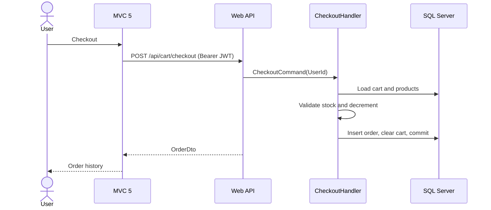
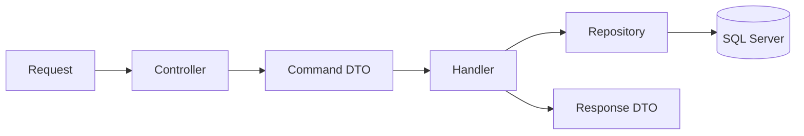

# UML diagrams

The diagrams use Mermaid and render in GitHub, Azure DevOps, and compatible Markdown viewers.

## Component diagram
```mermaid
graph TD
  MVC[ASP.NET MVC 5 Client] -->|HTTP/JWT| API[ShoppingCart.Api]
  API --> APP[ShoppingCart.Application]
  APP --> DOMAIN[ShoppingCart.Domain]
  API --> INFRA[ShoppingCart.Infrastructure]
  INFRA --> DB[(SQL Server)]
  INFRA -.implements. APP
```

## Domain class diagram
```mermaid
classDiagram
  Product { Guid Id; string Name; decimal Price; int Stock; DecreaseStock() }
  Cart { Guid UserId; Add(); Remove(); Total }
  CartItem { Guid ProductId; int Quantity; decimal UnitPrice }
  Order { Guid UserId; OrderStatus Status; decimal Total; MarkPaid() }
  OrderItem { Guid ProductId; int Quantity; decimal UnitPrice }
  Cart "1" *-- "many" CartItem
  Order "1" *-- "many" OrderItem
  CartItem --> Product
  OrderItem --> Product
```

## Checkout sequence


## Command-handler flow

